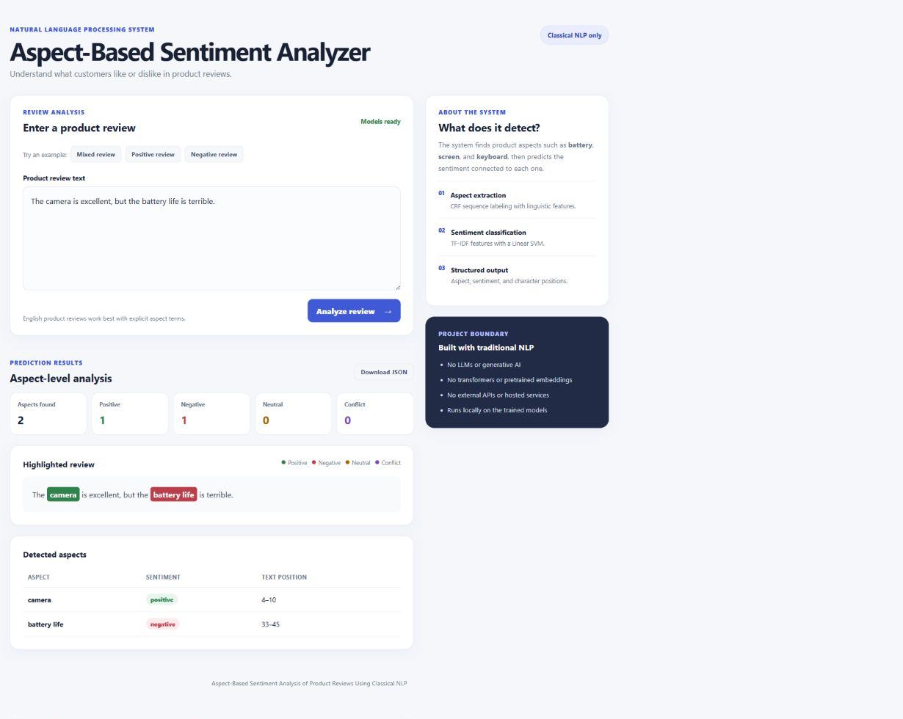
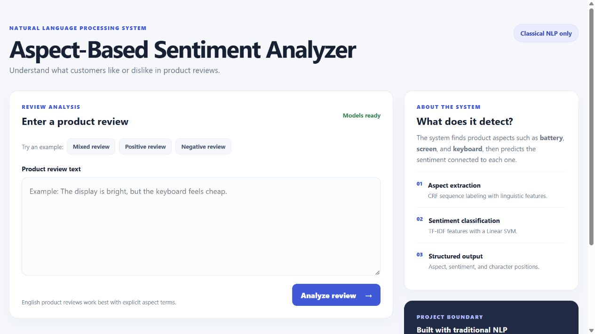
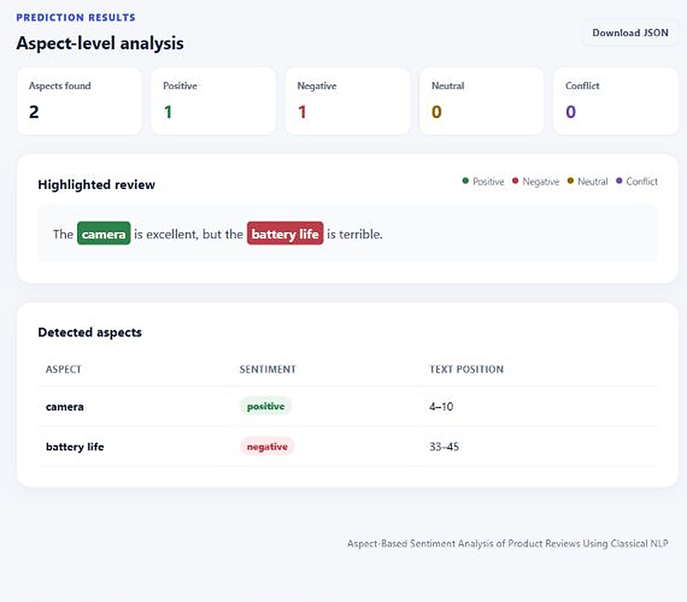
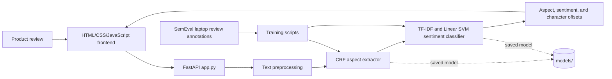

# Aspect-Based Sentiment Analysis of Product Reviews Using Classical NLP

[](https://www.python.org/)
[](https://fastapi.tiangolo.com/)
[](https://scikit-learn.org/)
[](LICENSE)
[](https://github.com/gunargrithvick/aspect-based-sentiment-analysis-of-product-reviews-using-classical-nlp/actions/workflows/quality.yml)

This project identifies product aspects in English laptop reviews and predicts the sentiment associated with each aspect. It is a standalone NLP system implemented with classical linguistic methods and traditional machine learning.

Project status: standalone NLP system and local frontend completed and verified.

## Overview

This repository contains a complete, locally runnable aspect-based sentiment analysis application. It identifies the specific product aspects mentioned in a review and predicts the sentiment attached to each aspect instead of assigning one sentiment to the whole review.

The project is designed as a practical FSD application for a Natural Language Processing course. It includes the NLP pipeline, trained model artifacts, a FastAPI backend, a responsive HTML/CSS/JavaScript frontend, automated tests, evaluation outputs, and deployment configuration.

## Highlights

- Extracts explicit product aspects such as `battery life`, `screen`, and `keyboard`.
- Predicts `positive`, `negative`, `neutral`, or `conflict` sentiment for each detected aspect.
- Uses a CRF sequence labeler and TF-IDF with a balanced Linear SVM.
- Preserves the character positions of predicted aspects in the original review.
- Provides command-line, JSON API, and browser-based interfaces.
- Can run locally with Uvicorn and is configured for Vercel deployment.
- Uses no LLMs, generative AI, transformers, pretrained embeddings, or external AI APIs.

Example:

```text
The camera is excellent, but the battery life is terrible.
```

Expected output:

```text
camera      -> positive
battery life -> negative
```

## Project rules

This project uses classical NLP and traditional machine learning only. It does not use LLMs, generative-AI APIs, transformers, sentence embeddings, pretrained embeddings, or text-generation models.

## Implemented methods

- Tokenization, lemmatization, POS tagging, and negation handling
- Rule-based baseline aspect extraction
- CRF-based aspect extraction
- TF-IDF and word/character n-grams
- SVM-based aspect-level sentiment classification
- Precision, recall, F1-score, accuracy, and confusion matrix evaluation

The preprocessing layer currently uses deterministic tokenization, character-offset preservation, conservative rule-based lemmatization, coarse POS features, and negation-scope features.

## Main tasks

1. Extract explicit aspect terms such as `battery`, `camera`, and `screen`.
2. Classify the sentiment associated with each aspect as positive, negative, neutral, or conflict where supported by the annotations.

## Dataset

The project uses the SemEval-2014 Task 4 Laptop Reviews dataset. The original files belong in `data/raw/` and should remain unchanged. Generated or converted files belong in `data/interim/` or `data/processed/`.

Read [docs/dataset_guide.md](docs/dataset_guide.md) before adding data.

Current dataset summary: 3,045 sentences, 2,358 aspect annotations, and 955 unique normalized aspect terms. The polarity labels are positive, negative, neutral, and conflict.

The raw XML dataset is intentionally not committed because redistribution permissions may vary. The trained runtime models are included, so the frontend and command-line analyzer work immediately after cloning. To reproduce preprocessing or retrain the models, download the dataset and place the unchanged `Laptop_Train_v2.xml` file in `data/raw/` as described in [docs/dataset_guide.md](docs/dataset_guide.md).

## Standalone system

The trained system can be run directly from the command line, independently of the browser frontend:

```bash
python scripts/analyze_review.py --text "The display is bright, but the keyboard feels cheap."
```

The command returns structured JSON containing each detected aspect, its sentiment, and its character positions. The browser interface is available separately below. See [docs/user_guide.md](docs/user_guide.md) and [docs/system_design.md](docs/system_design.md).

## Local frontend

The project also includes a browser-based frontend for the standalone NLP system. It is only an interface around the existing classical NLP pipeline; it does not add an LLM, generative AI, transformer, or external API. It can run locally or be deployed to Vercel.

Start it from the project root:

```powershell
python -m uvicorn app:app --reload
```

Then open `http://127.0.0.1:8000`. The frontend accepts a product review, highlights detected aspects, displays aspect-level sentiment, and allows the results to be downloaded as JSON. See [docs/frontend_guide.md](docs/frontend_guide.md) for Vercel deployment instructions.

## Screenshots

The screenshots below show the standalone frontend using the trained classical NLP models:

### Complete application flow



### Review input



### Aspect-level results



## Methodology

The system includes a simple baseline and an improved classical NLP pipeline. The comparison is used to justify the implementation choice:

- Rule-based aspect extraction using POS and noun-phrase patterns
- CRF sequence labeling for aspect extraction
- TF-IDF, word n-grams, and character n-grams
- SVM-based aspect-level sentiment classification
- Negation and local-context features

The detailed design is documented in [docs/methodology.md](docs/methodology.md).

## Architecture

The application is a standalone classical NLP system. The browser frontend sends review text to FastAPI, which loads the saved CRF and TF-IDF/Linear SVM models and returns structured aspect-sentiment results.



See [docs/system_design.md](docs/system_design.md) for module responsibilities and [docs/frontend_guide.md](docs/frontend_guide.md) for the application interface.

## Installation

Create a virtual environment and install the runtime dependencies:

```bash
python -m venv .venv
```

Windows PowerShell:

```powershell
.\.venv\Scripts\Activate.ps1
python -m pip install --upgrade pip
python -m pip install -r requirements.txt
```

macOS/Linux:

```bash
source .venv/bin/activate
python -m pip install --upgrade pip
python -m pip install -r requirements.txt
```

Development and testing tools are listed separately in `requirements-dev.txt`.

## Reproducible workflow

1. Put the unchanged source dataset in `data/raw/` when reproducing training.
2. Parse and convert annotations into `data/interim/`.
3. Save clean model-ready files in `data/processed/`.
4. Run experiments from the numbered notebooks in `notebooks/`.
5. Keep reusable implementation in `src/classical_absa/`.
6. Save trained models in `models/` and generated results in `outputs/`.
7. Save charts and tables in `reports/figures/` and `reports/tables/`.

The dataset and analysis scripts can be run from the project root:

```bash
python scripts/prepare_laptop_dataset.py
python scripts/explore_laptop_dataset.py
python scripts/prepare_preprocessed_data.py
python scripts/train_baseline.py
python scripts/train_improved_models.py
python scripts/evaluate_and_improve.py
python scripts/verify_system.py
```

To rebuild and verify the complete system in one command after the raw dataset has been added:

```bash
python scripts/build_system.py
```

See [docs/usage.md](docs/usage.md) for the working conventions.

## Evaluation

The project reports:

- Aspect extraction precision, recall, F1-score, and exact-match performance
- Sentiment accuracy, precision, recall, macro-F1, and a confusion matrix
- End-to-end correctness of complete `(aspect, sentiment)` pairs

The evaluation procedure and result-table template are in [docs/evaluation_plan.md](docs/evaluation_plan.md).

## Testing

Run the automated tests from the project root:

```bash
python -m pytest -q
```

The test suite covers preprocessing, token offsets, aspect extraction, baseline models, inference output, API validation, model health, and known positive/negative examples. The repository quality workflow also checks the full repository with Ruff and compiles the Python source files. See [docs/test_plan.md](docs/test_plan.md) for the complete verification plan.

## Folder structure

```text
docs/          Project definition and technical documentation
data/          Datasets and processed text files
notebooks/     Numbered experiments and analysis
src/classical_absa/  Reusable classical NLP source code
tests/         Tests for preprocessing and model components
models/        Saved classical NLP models
reports/       Figures, tables, and final report materials
outputs/       Generated predictions and evaluation results
frontend/      HTML templates for the browser interface
public/static/ CSS and JavaScript browser assets
docs/screenshots/ Verified frontend screenshots used in this README
app.py         FastAPI application and JSON API
vercel.json    Vercel deployment configuration
```

## Documentation

- [Project definition](docs/project_definition.md)
- [Dataset guide](docs/dataset_guide.md)
- [Methodology](docs/methodology.md)
- [Usage and reproducibility](docs/usage.md)
- [Evaluation plan](docs/evaluation_plan.md)
- [Baseline results](docs/baseline_results.md)
- [Improved model results](docs/improved_results.md)
- [Final evaluation and error analysis](docs/final_evaluation.md)
- [System requirements](docs/system_requirements.md)
- [System design](docs/system_design.md)
- [User guide](docs/user_guide.md)
- [Test plan](docs/test_plan.md)
- [Integration verification](docs/integration_verification.md)
- [Release checklist](docs/release_checklist.md)
- [Report structure](docs/report_structure.md)
- [Presentation outline](docs/presentation_outline.md)
- [Final project report](docs/final_project_report.md)
- [Frontend guide](docs/frontend_guide.md)
- [Naming conventions](docs/naming_conventions.md)
- [Contribution guidelines](CONTRIBUTING.md)
- [Change log](CHANGELOG.md)

## Limitations and responsible use

The system analyzes explicit text from one English product-review domain. It may struggle with sarcasm, implicit aspects, spelling errors, domain-specific vocabulary, and sentences containing several closely related opinions. Its predictions are for coursework and analysis, not for making high-impact decisions about people or businesses.

## Author

Guna Rithvick

## License

This project is licensed under the [MIT License](LICENSE).
